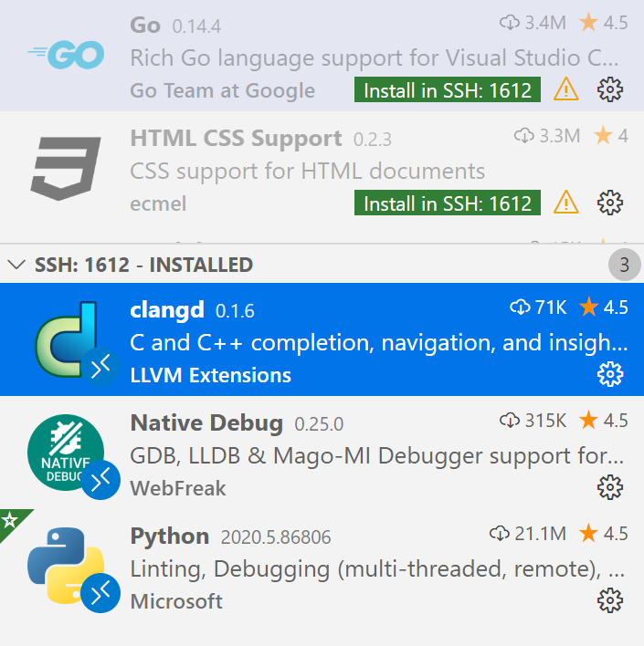

OneFlow 的开发环境为 Linux，如果我们想使用 GUI 开发、调试 OneFlow，可以采用 VS Code + Remote - SSH 插件的方案。

如果对于 VS Code 及其插件系统还不熟悉，可以参阅[官方文档](https://code.visualstudio.com/docs)。

本文包括：

* 如何编译 `Debug` 版本的 OneFlow

* 远程调试所必要的 VS Code插件的安装配置

### 编译 Debug 版本的 OneFlow

如果使用 `Release` 版本的 OneFlow，因为存在编译器优化的问题，在调试过程中可能会出现程序实际运行位置与源码行不对应。

因此我们需要编译 `Debug` 版本的 OneFlow，并且需要生成 clangd 所需要的json文件。

在运行 cmake 的时候需要加上 `Debug` 及 `CMAKE_EXPORT_COMPILE_COMMANDS` 的 flag

```shell
cmake .. \
-DCMAKE_BUILD_TYPE=Debug \
-DCMAKE_EXPORT_COMPILE_COMMANDS=1
```
以上的

* `-DCMAKE_BUILD_TYPE=Debug` 选项指定编译 Debug 版本

* `-DCMAKE_EXPORT_COMPILE_COMMANDS` 选项会在 `build` 目录下生成后文clangd 配置时所需要的 `compile_commands.json` 文件。

### Remote - SSH
通过 VS Code 的 Remote SSH 插件，可以通过 ssh 的方式连接远程服务器。


我们的被调试对象 OneFlow 可以运行在远程主机上，然后通过 Remote SSH 将远程的情况和本地的 VS Code 用户操作连接起来， **像调试本地程序一样调试远程主机上的程序**。

安装完成 Remote - SSH 后，按 F1，在弹出的搜索栏中选择 `Remote-SSH: Connect to Host...`，即可设置 ssh 的连接信息，连接远程主机。

Remote - SSH 连接远程主机后，在插件一栏，会自动分类“远程”与“本地”，如果检测到需要在远程电脑上安装的插件，会显示为灰色，并带有 **Install in SSH:远程主机名** 的按钮，点击即可将对应插件安装在远程主机。



如上图，我们已经在远程主机安装 Python、clangd、Native Debug 插件，用于支持远程调试 OneFlow。

但是远程主机并没（本地主机已经安装的）Go 和 HTML CSS Support 插件。


### clangd
经过简单的配置，clangd可以为我们提供代码补全、符号跳转等便利。

在配置 clangd 之前，需要确认：

* 已经通过编译，生成了`compile_commands.json`文件；

* 已经通过 Remote - SSH 在远程主机上安装了 clangd 插件。

* 建议 **不要** 安装 VS Code 推荐的 ms-vscode.cpptools C/C++ 插件，因为 clangd 有可能与之冲突

#### 安装 clangd 程序
VS Code 上的插件，是通过与 clangd 服务程序交互，获取解析信息并显示的。因此除了安装 VS Code 上的 clangd 插件外，我们还需要在 **OneFlow 源码所在的主机上** （本文中为远程 Linux 主机）安装 clangd 服务程序。

我们将采用下载 zip 文件并解压的方式安装 clangd，更多安装方法，可以参考 [clangd 官方文档](https://clangd.llvm.org/installation.html)。

首先，在[这个页面](https://github.com/clangd/clangd/releases/)下载与我们系统平台对应的clangd压缩包，并解压。
解压后可先运行 clangd 测试下，确保能正常运行后再进行后续配置。

```shell
/path/to/clangd/bin/clangd --help
```

#### 配置 VS Code 中的 clangd 插件

将 build 目录下的 `compile_commands.json` 文件软链接到 OneFlow 的源码根目录下，在OneFlow的源码根目录下：

```shell
ln -s ./build/compile_commands.json compile_commands.json
```

然后 `Ctrl+Shift+P` (macOS 下 `command+shift+p`)，找到 `Open Remote Settings` 选项，打开 `settings.json` 配置文件，在其中加入以下配置：

```json
    "clangd.path": "/path/to/bin/clangd",
    "clangd.arguments": [
        "-j",
        "12",
        "-clang-tidy"
    ]
```
`clangd.arguments`的意义及更多参数选项，可查阅`clangd --help`。

#### 使用 clangd
在 VS Code 的 View->Output 面板，下拉菜单中选择 "Clang Language Server"，可以看到 clangd 的解析输出，解析完成后。选择 C/C++ 源码中的符号，可以实现跳转。

按`Ctrl+P` (macOS 下 `command+P`) 后通过`@符号名`或`#符号名`可以分别实现当前文件内查找符号，或工程范围内查找符号。


### native debug
`Ctrl + Shift + D` (macOS 下 `command+shift+D`) 或者点击 activity bar 的 Run 按钮，进入到 Run 视图。


选择 `Create a launch.json file`，选择 gdb 模板。


然后设置相关参数：
```json
{
    "version": "0.2.0",
    "configurations": [
        {
            "name": "lenet", //自定义任务名
            "type": "gdb",
            "request": "launch",
            "target": "/home/yaochi/.conda/envs/ycof/bin/python3", //python路径
            "arguments": "lenet_train.py", //脚本
            "cwd": "/home/yaochi/of_example", //脚本所在路径
            "valuesFormatting": "parseText"
        }
    ]
}
```

设置断点后，F5 启动调试：


### 其它

* 如果 VS Code 下载插件速度过慢，可以按照[官方文档](https://code.visualstudio.com/docs/setup/network)的步骤切换 `hostname` 或者设置代理。

* 关于 clangd 安装配置的[官方介绍](https://clang.llvm.org/extra/clangd/Installation.html)

* 关于 VS Code 的调试设置的[官方介绍](https://code.visualstudio.com/docs/editor/debugging)

* clangd 的最新版本可能对 glibc 版本要求过高，导致报缺少库的错误。

```shell
./bin/clangd: /lib64/libc.so.6: version `GLIBC_2.18' not found (required by ./bin/clangd)
```

此时可以下载其它更低 clangd 的版本，早期版本的 clangd 需要到 [LLVM官网](https://releases.llvm.org/download.html) 下载整个LLVM工具链，其中包含有 clangd。
