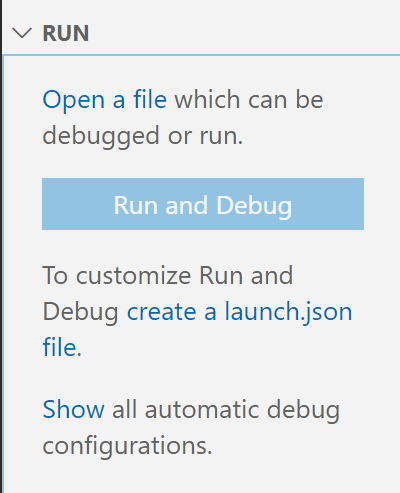

## Use VS Code to debug OneFlow

The developing environment of OneFlow is Linux. If we want to use GUI develop or debug OneFlow. We can use VS code with a Remote - SSH connection to server.

If you are not familiar with VScode please refer to [official documentation](https://code.visualstudio.com/docs).

This article:

* How to compile the  `Debug` version of OneFlow.

* The necessary extension packages of VS code and installed guidelines.

### Compile the Debug version of OneFlow.

If we use the  `Release` version of OneFlow, you may have problems with compiler optimization during debugging, and the location of actual running program may not correspond to the source code.  

Thus, we need to compile  `Debug` version of OneFlow. And need to generate json files need by clangd.

When running cmake, we need add flag of  `Debug` and `CMAKE_EXPORT_COMPILE_COMMANDS`

```shell
cmake .. \
-DCMAKE_BUILD_TYPE=Debug \
-DCMAKE_EXPORT_COMPILE_COMMANDS=1
```
Above code:

* `-DCMAKE_BUILD_TYPE=Debug`  choose the version of Debug.

* `-DCMAKE_EXPORT_COMPILE_COMMANDS`  will generate the  `compile_commands.json` files need by clangd in  `build`.

### Remote - SSH
Use the  Remote SSH of  VS Code can use SSH connects to a server.


We can operate the OneFlow on server and use Remote SSH connect  VS Code. **It can let user debug code just like local environment**.

After finishing Remote - SSH installation, press F1 then enter `Remote-SSH: Connect to Host..` to search. You can connect to server after setting the connection information for SSH.

After using Remote - SSH, in plugin column, will automatically classify the local and remote. If a plugin that needs to be installed on a remote computer is detected, it will show in grey and with a button called **Install in SSH: remote server name**. Click on that can install the corresponding plugins.


Like the figure show, we have already installed Python, clangd and NativeDebug in order to support remote configuration.

But the remote server didn’t installed Go and HTML CSS Support plugin.


### clangd
After simple configuration, Clangd can provide us with the convenience of code completion, symbol jump, etc.

Before configuring clangd, we need to make sure:

* We have already compiled and generated `compile_commands.json` file.

* We have already used Remote - SSH to install clangd on remote server.

* We **do not** recommend installing ms-vscode.cpptools C/C++ which is recommended by VS Code. Because the clangd might conflict with it. 

#### Installing clangd
The plugin on VS code use clangd services to interact and get information then display. Thus, in addition to install clangd plugin on VS code. We also need to install clangd services program on **the server which have OneFlow source code**.

We **download zip file and unpack** to install. More methods please refer to [clangd offical site](https://clangd.llvm.org/installation.html).

First, download the clangd corresponding to our platform on [this site](https://github.com/clangd/clangd/releases/) and unzip. After unzipping, run the clangd test to make sure everything can run normally.

```shell
/path/to/clangd/bin/clangd --help
```

#### Config clangd in VS code

Link the  `compile_commands.json` in "build" dictionary to OneFlow source code dictionary:

```shell
ln -s ./build/compile_commands.json compile_commands.json
```

Then `Ctrl+Shift+P` (macOS use `command+shift+p`), find  `Open Remote Settings`  and open  `settings.json` add the following configuration:

```json
    "clangd.path": "/path/to/bin/clangd",
    "clangd.arguments": [
        "-j",
        "12",
        "-clang-tidy"
    ]
```
More meaning or parameters of `clangd.arguments` please refer to `clangd --help`.

#### Using clangd
In View->Output dashboard in VS code, we can choose "Clang Language Server" in dropdown list. We can view the analysis output of clangd. After analysing the output,Choose the symbols of C/C++ source codes can switch to an other site.

By use `@symbols name` or `#symbols name` through `Ctrl+Shift+P` (In macOS: `command+shift+P`) can find the symbols in current file or in current project.


### native debug
Use `Ctrl + Shift + D` (In macOS: `command+shift+D`)  or click the Run button on activity bar can switch to view of Run.



Choose `Create a launch.json file` then choose gdb template. 

Config relevant parameters:
```json
{
    "version": "0.2.0",
    "configurations": [
        {
            "name": "lenet", //defined job name
            "type": "gdb",
            "request": "launch",
            "target": "/home/yaochi/.conda/envs/ycof/bin/python3", //python path
            "arguments": "lenet_train.py", //script 
            "cwd": "/home/yaochi/of_example", //script path
            "valuesFormatting": "parseText"
        }
    ]
}
```

After set the break, press F5 to debug.

### Others:

* If the download speed is too slow in VS code, you can refer to [offcial document](https://code.visualstudio.com/docs/setup/network) and change `hostname` or set SSH connection.

* The [official introduction](https://clang.llvm.org/extra/clangd/Installation.html) about install of clangd.

* The [official introduction](https://code.visualstudio.com/docs/editor/debugging) about configuration of VS code.

* The latest version of clangd may have special requirements of glibc. That may lead to raise some errors on missing libraries.

```shell
./bin/clangd: /lib64/libc.so.6: version `GLIBC_2.18' not found (required by ./bin/clangd)
```

We can download the older version of clangd. Older version of clangd is available on [LLVM official site](https://releases.llvm.org/download.html). Download the LLVM tools package have clangd inside.
